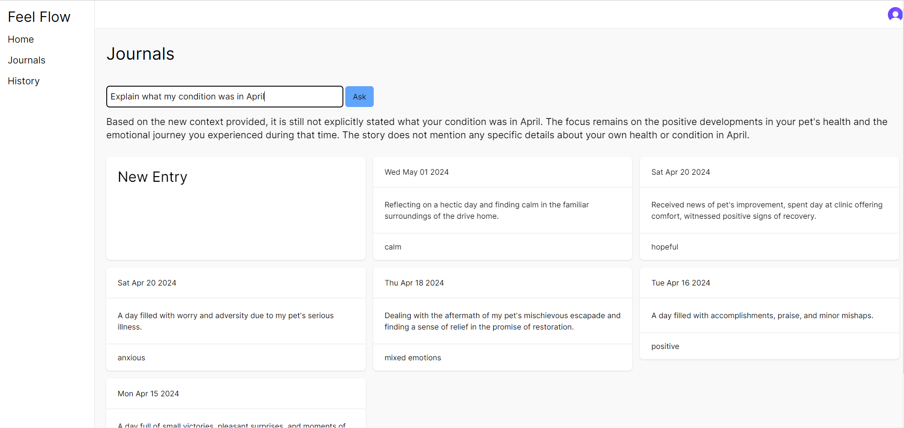
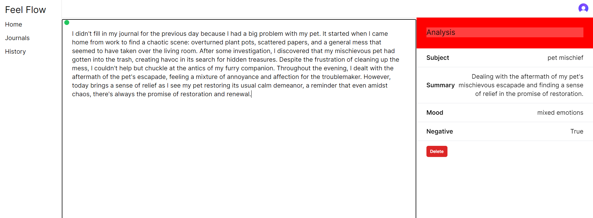
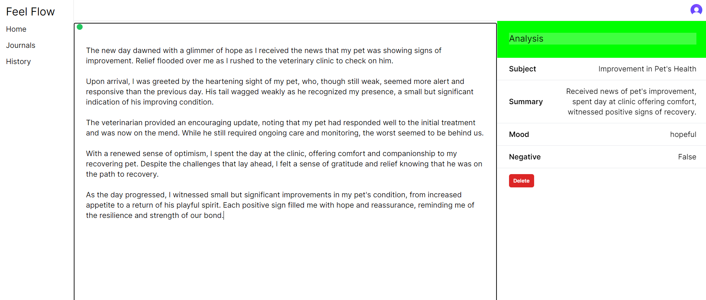
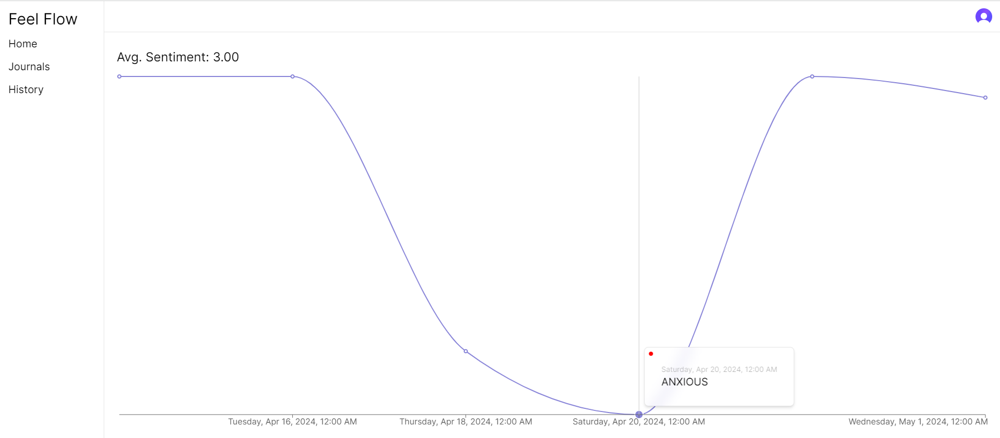

# FeelFlow AI powered Next.js app
## The FeelFlow application, developed using the NextJs framework powered by OpenAI, allows to determine the user’s mood by the text he introduces.

## How to run it locally
**Warning:** To run this application you must have a paid subscription to [openAi](https://openai.com/).

To run this application locally, you need to follow a few steps:
### I. Create an account for authentication:
1. Go to https://clerk.com/ and create an account for quick authentication in the application;
2. Once you are logged into your dashboard, go to the API Keys page and copy the `NEXT_PUBLIC_CLERK_PUBLISHABLE_KEY` and `CLERK_SECRET_KEY` keys;
3. Create a file `.env.local` in the root directory of the project and insert these variables with keys there;

### II. Add additional keys to `.env.local` for right redirection for authentication:
```bash
NEXT_PUBLIC_CLERK_SIGN_IN_URL=/sign-in
NEXT_PUBLIC_CLERK_SIGN_UP_URL=/sign-up
NEXT_PUBLIC_CLERK_AFTER_SIGN_IN_URL=/journal
NEXT_PUBLIC_CLERK_AFTER_SIGN_UP_URL=/new-user
```
### III. Create an account on openAI:
1. Go to https://openai.com/ and create an account for the `API` to integrate OpenAI models into your application;
2. On the [Billing page](https://platform.openai.com/settings/organization/billing/overview) and top up your credit balance with the minimum amount;
3. Go to [API keys](https://platform.openai.com/api-keys) page and create new secret key ( this can be done without a paid subscription, but you will not be able to use this key );
4. Add `OPENAI_API_KEY` with your openAI secret key to `.env.local`
### IV. To connect a `sqlite` database, follow these steps:
1. Create a `.env` file;
2. Add the following line to the `.env` file:
```bash
DATABASE_URL="file:./dev.db"
```
### V. Open a terminal in the root of the application folder and run the following scripts:
```bash
# Install dependencies
npm install

# To create the database and run the migration, run:
npx prisma generate
npx prisma migrate dev --name init

# To run project execute
npm run dev
```

## The setup is complete, you can use your application locally or deploy it to Vercel or other hosting.

## Some examples of what the application looks like:
### Fig.1 List of journals with the ability to ask a question about the journals and get an answer using openAI.

### Fig.2-3 Page with entered journal entry with automatic mood check using OpenAI.


### Fig.4 Graph depicting the change in user mood based on all journal entries using openAI
